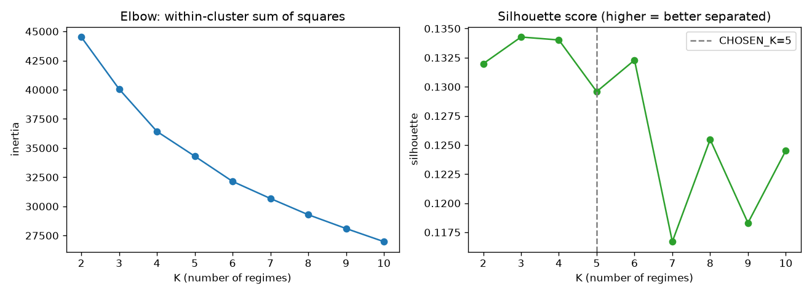
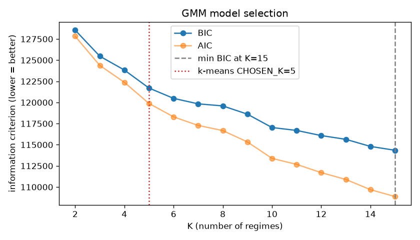

# Macro Regime Radar

Detects and explains shifting macro "regimes" in **gold** and **crude oil** by
clustering them against their macro drivers — the **US Dollar Index**, the
**10-year Treasury yield**, and the **VIX** — over 2004–present.

A regime is a stretch of time where these assets are governed by the same
underlying force: the dollar, real yields, a safe-haven bid, a commodity
supply shock, or a full-blown crisis. The model is **unsupervised** — it
never sees a news headline — yet its regime boundaries repeatedly land within
days of the events that caused them.

| Regime shift the model found | What actually happened | Gap |
|---|---|---|
| 2008-09-15 → **Crisis** | Lehman Brothers files for bankruptcy | same day |
| 2020-03-09 → **Crisis** | OPEC+ breakdown / Saudi–Russia oil price war | −1 day |
| 2022-02-25 → Safe-Haven | Russia invades Ukraine | −1 day |
| 2016-06-24 → Safe-Haven | Brexit referendum result | same day |
| 2023-03-23 → Safe-Haven | Silicon Valley Bank fails | −13 days |
| 2019-09-16 → Safe-Haven | Abqaiq oil-facility attack | −2 days |

---

## How it works

Seven stages, each a standalone script in `src/`:

| # | Stage | Script | Output |
|---|---|---|---|
| 1 | Fetch & align 5 daily series | `fetch_data.py` | `data/raw_prices.csv` |
| 2 | Clean (holidays, bad prints) | `clean_data.py` | `data/clean_prices.csv` |
| 3 | Rolling features (20-day window) | `build_features.py` | `data/features.csv` |
| 4 | Regime clustering (k-means + GMM) | `detect_regimes.py`, `compare_regimes.py` | diagnostics |
| 5 | Interactive dashboard | `dashboard.py` | Streamlit app |
| 6 | Tie macro events to regime shifts | `annotate_events.py` | `data/regime_shifts.csv` |
| 7 | Daily automation | `.github/workflows/daily-update.yml` | auto-committed data |

```
raw_prices.csv ──clean──▶ clean_prices.csv ──features──▶ features.csv
                                                              │
                          events.csv ──┐                      ▼
                                        ├──annotate──▶  regimes_gmm.csv ◀── frozen GMM
                          regime_shifts.csv ◀──────────┘      │
                                                              ▼
                                                         dashboard.py
```

## Methodology notes

- **Log returns, not percent change.** `ln(Pₜ) − ln(Pₜ₋₁)` is additive across
  time and roughly symmetric, which clustering prefers. The 10-year yield is
  left as a *level* — it's already a rate, so "percent change of a percent"
  isn't meaningful.
- **Features are rolling, not daily.** The model clusters on 20-day rolling
  volatility, cross-asset return correlations (gold–oil, gold–dollar,
  gold–VIX, oil–dollar), and momentum. Single-day returns are pure noise;
  the rolling features are the smooth, persistent thing a "regime" actually
  is.
- **Standardize first.** k-means and GMM measure distance with a plain sum of
  squares, so `yield_10y ≈ 3` would swamp `gold_vol_20d ≈ 0.01` without a
  `StandardScaler`.
- **Choosing K is a judgment call.** The elbow is smooth and the silhouette
  is flat (~0.13 for every K); the GMM's BIC never bottoms out. Market days
  form a *continuum*, not tidy separated blobs. **K = 5** was chosen because
  the resulting regimes are interpretable and a rare (~6% of days) crisis
  regime falls out that cleanly isolates 2008 and 2020.
  <br>
  
- **k-means vs GMM.** They agree on 67% of days and are near-identical on the
  crisis regime (209 of 211 days shared). The GMM is used as canonical
  because its soft probabilities expose transitions: on the ~4% of days where
  it is under 60% confident, ~90% sit within three days of a regime change.
- **Episode smoothing.** Raw labels flicker for a day or two around
  transitions. Episodes shorter than 10 trading days are merged into their
  longer neighbour before anything is displayed (279 raw episodes → 93).

## The five regimes

Full-history averages (smoothed labels):

| Regime | Share | Avg gold daily ret. | Avg oil daily ret. | Gold vol (20d) | Oil vol (20d) | Gold–oil corr | Avg 10Y yield |
|---|--:|--:|--:|--:|--:|--:|--:|
| **Calm / Low-Rate** | 38% | +0.019% | −0.067% | 0.008 | 0.018 | +0.15 | 2.35% |
| **High-Yield** | 29% | +0.112% | +0.043% | 0.010 | 0.020 | +0.19 | 4.34% |
| **Commodity-Macro** | 13% | −0.010% | +0.142% | 0.014 | 0.019 | **+0.55** | 2.88% |
| **Safe-Haven** | 13% | +0.038% | +0.175% | 0.012 | 0.029 | −0.02 | 2.36% |
| **Crisis** | 6% | −0.026% | **−0.201%** | 0.021 | **0.060** | +0.07 | 3.26% |

*Commodity-Macro* is where gold and oil move as a bloc (correlation +0.55) —
a common macro force in charge. *Safe-Haven* is where that link breaks and
gold decouples from the dollar. *Crisis* is unmistakable: oil volatility
triple its normal level and sharply negative returns everywhere.

## Running it

```bash
python3 -m venv venv && source venv/bin/activate
pip install -r requirements.txt

# Rebuild the data pipeline from scratch (hits Yahoo Finance):
cd src
python3 fetch_data.py
python3 clean_data.py
python3 build_features.py
python3 score_regimes.py --fit     # baseline the frozen regime model
python3 annotate_events.py

# Launch the dashboard:
python3 -m streamlit run dashboard.py
```

The dashboard shows the current regime, a gold-vs-oil chart with regime
shading and event markers, the macro drivers, a full-history regime ribbon,
a table of which events drove which shifts, and per-regime statistics.

## Automation

`.github/workflows/daily-update.yml` re-runs stages 1–3 + 6 on weekday
mornings and commits the refreshed CSVs back to `main`, so the repo is a
living dataset and the dashboard runs on a fresh clone.

It **does not re-fit** the clustering model. Re-fitting on each new day would
let one row nudge the cluster boundaries and silently relabel years-old
dates. Instead the scaler + GMM + regime numbering are frozen once into
`models/regime_gmm.joblib`, and the daily job only *scores* new days against
those fixed parameters (`score_regimes.py`). Re-baseline deliberately with
`score_regimes.py --fit`.

## Project structure

```
src/
  fetch_data.py       Stage 1  — multi-asset download + alignment
  clean_data.py       Stage 2  — missingness + impossible-price handling
  build_features.py   Stage 3  — rolling vol / correlations / momentum
  detect_regimes.py   Stage 4  — k-means + K-selection diagnostics
  compare_regimes.py  Stage 4  — GMM vs k-means comparison
  regime_model.py     Stage 7  — the frozen production model
  score_regimes.py    Stage 7  — score days with the frozen model
  regime_labels.py             — shared smoothing / episode / shift helpers
  annotate_events.py  Stage 6  — match curated events to regime shifts
  dashboard.py        Stage 5  — Streamlit app
data/
  events.csv          51 hand-curated macro events (2004–2026), with sources
  *.csv               pipeline outputs, refreshed daily
models/
  regime_gmm.joblib   frozen scaler + GMM + regime numbering
```

## Data & caveats

- Prices are daily closes from Yahoo Finance via `yfinance`: gold (`GC=F`),
  crude oil (`CL=F`), US Dollar Index (`DX-Y.NYB`), 10-year yield (`^TNX`),
  VIX (`^VIX`).
- The model is fit on the whole history, so regime *definitions* implicitly
  "see" the future. That's fine for explaining the past — which is the goal
  — but it would be look-ahead bias if used as a live trading signal.
- Regime labels for the most recent few weeks are provisional: Yahoo revises
  recent closes, and a 20-day rolling feature carries that revision backward.
- `events.csv` is curated by hand; each row links to a source. Events after
  the model's knowledge horizon were filled in from public reporting.
